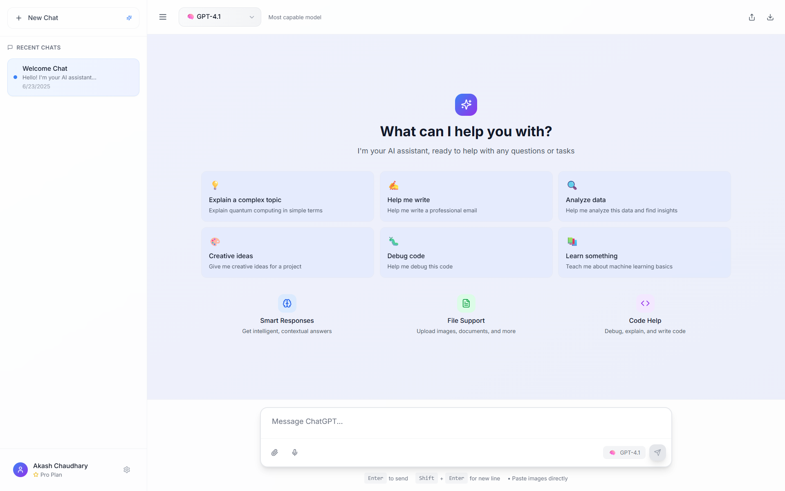

<div align="center">
  <h1>Fidel WebUI</h1>
  <p><strong>User-facing Next.js web interface for the Fidel conversational application stack</strong></p>
  <p>
    Authenticated chat UX, conversation history, SSE response streaming, optimistic message rendering,
    and a production-shaped frontend layer designed to work with <code>fidel-api</code> and <code>fidel-inference</code>.
  </p>
  <p>
    
    
    
    
    
    
    
  </p>
</div>



## Overview

Fidel WebUI is the browser client for the Fidel stack. It provides the authenticated, user-facing
experience for conversational workflows while preserving a narrow and stable integration boundary
with the backend services that own identity, conversation persistence, and model inference.

The application is structured around a few clear frontend layers:

- `app` for route entrypoints, layout, and app-shell wiring
- `components` for chat, sidebar, auth, and shared UI behavior
- `lib` for API integration helpers, streaming normalization, and data shaping
- `tests` for unit coverage and Playwright browser smoke validation

## Role In The Fidel Stack

Fidel is split into three cooperating services:

- `fidel-webui` is the user-facing web application where users authenticate, browse conversations, and interact with streaming chat responses.
- `fidel-api` is the authenticated orchestration layer responsible for users, conversations, message history, and SSE chat forwarding.
- `fidel-inference` is the model-serving backend that exposes the inference surface consumed by `fidel-api`.

This repository intentionally stays focused on the client layer. It does not reimplement backend
concerns, and this cleanup preserves the existing API contract exactly.

## Why This Project

- Protected chat routes with persisted auth restore
- Conversation history loading with incremental pagination
- Message history loading with incremental pagination
- SSE chat streaming with optimistic message rendering
- Route-safe handling for new-chat creation during streaming
- Abortable in-flight responses with UI recovery
- Light and dark theme support
- Frontend-side normalization for tolerant backend response shapes
- Unit and browser smoke tests that do not require a live backend

## Stack At A Glance

| Layer | Technology |
| --- | --- |
| App Framework | Next.js 14, React 18 |
| Styling | Tailwind CSS |
| Icons | `lucide-react` |
| Markdown Rendering | `react-markdown`, `remark-gfm`, `rehype-highlight` |
| State | React context providers and local feature hooks |
| Streaming | SSE client consumption over `fetch` |
| Testing | Node test runner, Playwright |

## Integration Surface

### Required Environment Variables

| Variable | Purpose |
| --- | --- |
| `NEXT_PUBLIC_API_URL` | Optional local override for the authenticated chat backend; deployed environments default to same-origin `/api/v1` |
| `NEXT_PUBLIC_PAGE_SIZE` | Page size used for `GET /chats/:id` message history |
| `NEXT_PUBLIC_CH_PAGE_SIZE` | Page size used for `GET /chats` conversation history |

### Expected Backend Routes

| Method | Route | Purpose |
| --- | --- | --- |
| `POST` | `/auth/login` | Authenticate and return a bearer token |
| `POST` | `/auth/register` | Create a user account |
| `GET` | `/users/me` | Return the current authenticated user |
| `GET` | `/chats` | List conversations with `limit` and `offset` |
| `GET` | `/chats/{id}` | Return paginated message history |
| `POST` | `/chats/stream?id=<conversation_id>` | Stream an assistant response and optionally reuse a conversation |
| `DELETE` | `/chats/{id}` | Delete a conversation |

Authentication uses:

```http
Authorization: Bearer <token>
```

### Response Tolerances Preserved By The Frontend

- Chat summaries accept `id`, `chat_id`, or `chatId`.
- Chat timestamps accept `created_at|createdAt|created` and `updated_at|updatedAt|modified_at`.
- Chat preview text accepts `last_message|lastMessage|preview|summary`.
- Messages accept `id|message_id|messageId` and `content|text|body`.
- Message timestamps accept `created_at|createdAt|created|timestamp`.
- Stream payloads expect `choices[0].delta`, `chat_info`, and may include `id`, `message_id`, `messageId`, and `done`.

Example stream event payload:

```json
{
  "id": "assistant-123",
  "created": 1714300000,
  "choices": [
    {
      "delta": {
        "role": "assistant",
        "content": "Hello"
      }
    }
  ],
  "chat_info": {
    "id": "chat-123",
    "title": "New chat"
  },
  "done": false
}
```

## Quick Start

### Prerequisites

- Node.js `18.17+`
- npm `9+`
- A reachable `fidel-api` deployment or another backend exposing the same contract

### Environment Setup

Create a local environment file:

```bash
cp .env.example .env
```

Configure the backend base URL:

```env
NEXT_PUBLIC_API_URL=http://localhost:8000/api/v1
```

Optional pagination controls:

```env
NEXT_PUBLIC_PAGE_SIZE=10
NEXT_PUBLIC_CH_PAGE_SIZE=10
```

### Run The Web Interface

Install dependencies and start the development server:

```bash
npm install
npm run dev
```

The app runs locally at `http://localhost:3000`.

## Project Structure

```text
app/
  auth/            # auth route
  chats/           # chat shell routes
  data/            # prompt and model configuration
  layout.js        # root layout and providers
components/
  auth/            # auth-specific components
  chat/            # message list, composer, streaming hooks
  contexts/        # auth, chat, theme, and request state
  sidebar/         # chat history and user controls
lib/
  auth.js          # auth API integration
  chatApi.js       # chat request entrypoint
  chatData.mjs     # normalization and merge helpers
  chatStream.mjs   # SSE streaming client utilities
tests/
  unit/            # node-based unit tests
  e2e/             # playwright browser smoke coverage
```

## Testing

Run the core verification steps:

```bash
npm run lint
npm run test
npm run build
```

Run browser smoke tests:

```bash
npm run test:e2e
```

Available test scripts:

- `npm run test:e2e`: build plus the smoke suite
- `npm run test:e2e:smoke`: explicit smoke suite entrypoint
- `npm run test:e2e:full`: build plus the full Playwright selection

The Playwright suite mocks the backend in-browser, so routine frontend verification does not
require a running `fidel-api` instance.

In cluster deployments the app defaults to `/api/v1`, so the same built image can move from
staging to production unchanged.

## Development Focus

- Preserve the frontend-to-backend contract exactly while improving internal maintainability.
- Keep streaming message behavior predictable under optimistic updates, late IDs, and aborts.
- Make component boundaries clearer so chat, history, and sidebar behavior remain easy to change safely.
- Maintain a professional, testable web interface that fits cleanly into the larger Fidel system.
